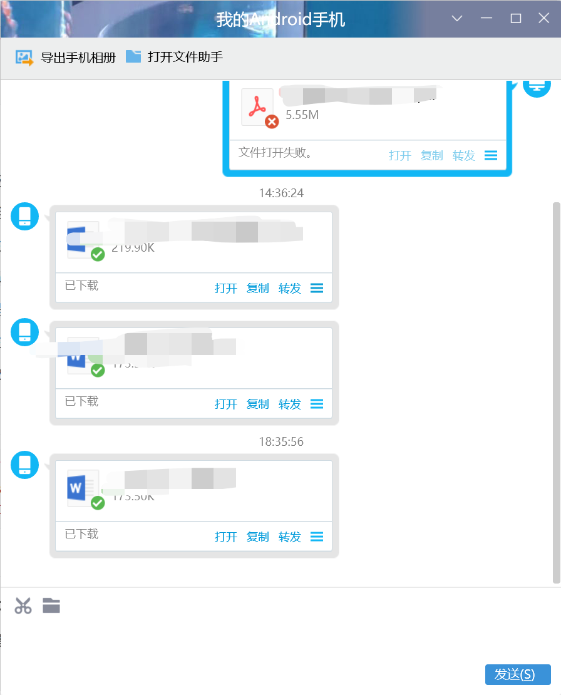
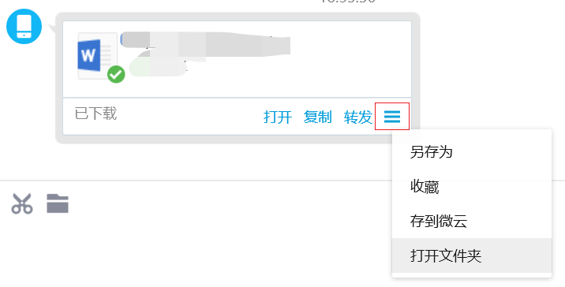
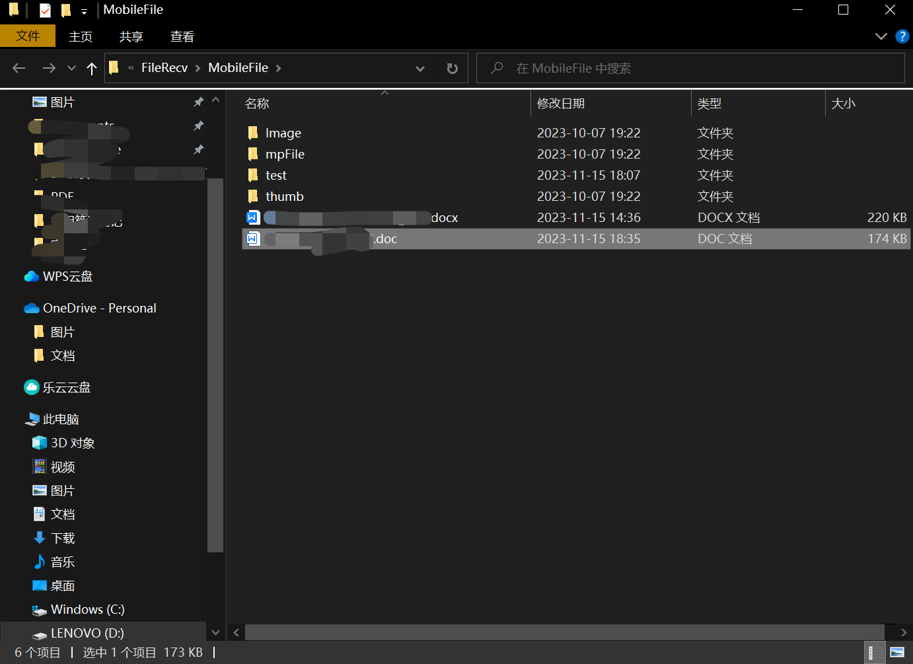
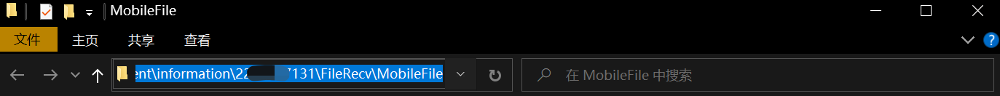
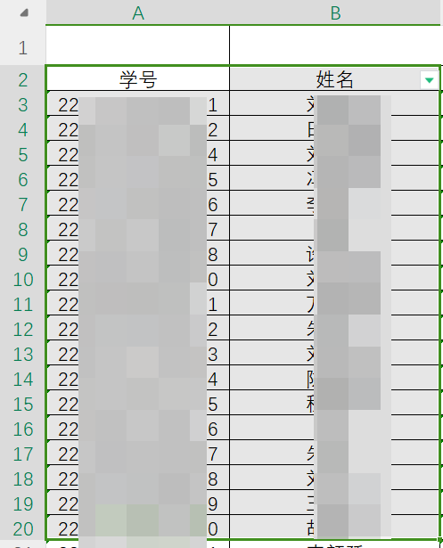
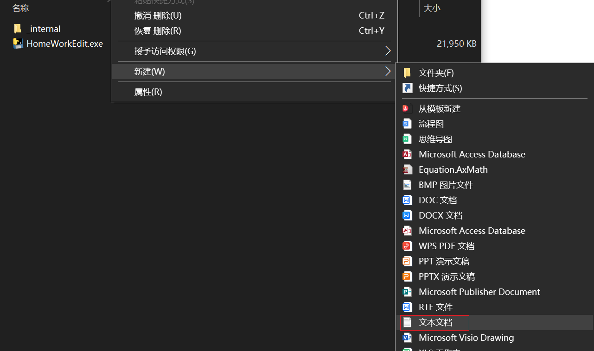
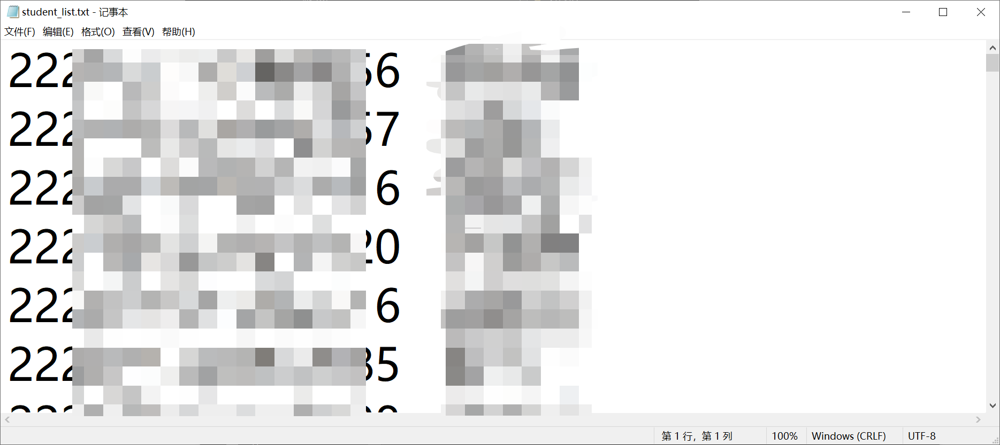
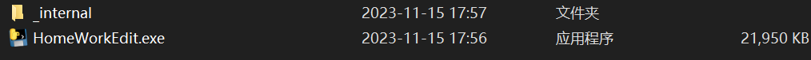
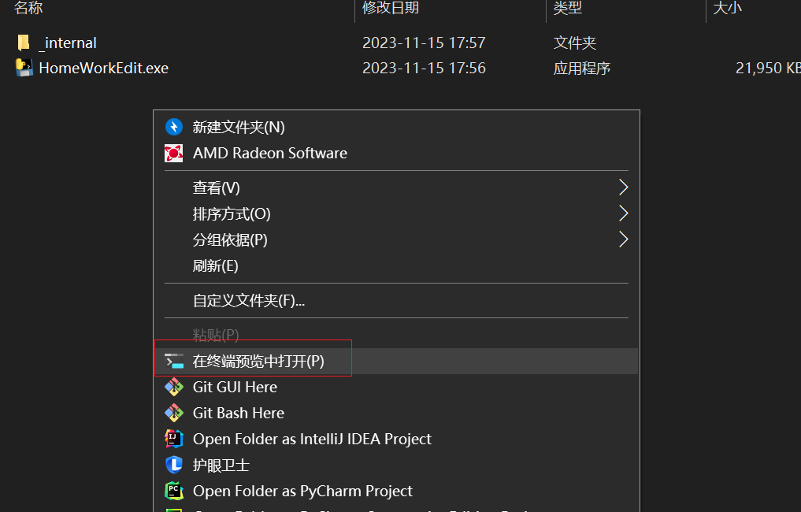
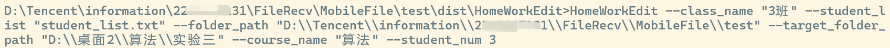

# 作业收集＋改名辅助脚本

## 介绍

**该项目借助QQ这个平台，无需其它平台介入，更加亲民化且不会很大的改变收作业的习惯，但可以极大的提升收作业的效率！**

#### `HomeWorkEdit.py`

这个 Python 脚本用于处理学生提交的作业文件，检查文件名是否包含指定的**课程名**和**学生姓名**，并将符合条件的文件移动到目标文件夹。同时，它会显示哪些学生没有提交作业。

**注意！！！！**：**课程名**最好是让同学们加上，且需要**统一一个名字**，因为一个文件夹可能会有多个包含该学生姓名的文件，加上课程名便可指定收集一个科目的作业。

故而使用本程序只需要学生命名是`姓名＋课程名`**（姓名在前课程在后）**，便可输出格式为`班级+学号+姓名`的文件，并输出未交同学的名单。

## 用法

```bash
HomeWorkEdit.exe --class_name [班级名称] --student_list [学生名单文件路径] --folder_path [源文件夹路径] --target_folder_path [目标文件夹路径] --course_name [课程名称] --student_num [学生学号的位数] --move [是否删除源文件，True 或 False，默认为 True]
```

## 参数说明

- `--class_name`: 班级名称，用于构建目标文件名。
- `--student_list`: 包含学生名单的文件路径，应为 **tab 分隔的文本文件**。
- `--folder_path`: 学生提交作业的源文件夹路径。
- `--target_folder_path`: 目标文件夹路径，用于存储处理后的作业文件。
- `--course_name`: 课程名称，用于匹配作业文件名。
- `--student_num`: 学生学号的位数，用于构建目标文件名。
- `--move`: 是否删除源文件，True 或 False，默认为 True**（建议删除，防止第二次提交到相同文件夹时收到上一次的作业）**。

## 示例

- [ ] ```bash
  HomeWorkEdit.exe --class_name "3班" --student_list "student_list.txt" --folder_path "D:\\Tencent\\information\\2225967131\\FileRecv\\MobileFile" --target_folder_path "D:\\桌面\\大三上\\算法" --course_name "算法"
  ```


## 演示过程

#### **当同学交作业时，在手机上将同学发的QQ文件转发给我的电脑：**



可以看到转发后就自动下载了，然后我们就需要查看**下载的路径**：



打开文件夹后我们可以看到：



#### 复制文件路径

在文件夹上方将地址复制下来（如图**蓝色部分**，复制路径）：



并修改路径，即将路径中的每一个`\`修改为`\\`**（建议将路径保存在一个txt文件中，方便以后复制）**

接下来将**创建一个存放该作业目录的地方**，同样方法复制目录的路径并修改路径，比如我的位置在`D:\桌面\算法\实验三`，将其修改为`D:\\桌面\\算法\\实验三`，并将其**保存到txt文件中**，方便后续的复制

#### 制作student_list.txt:

最直接的方式就是将班级的花名册（excel）选中有学号姓名的区域并复制，在任意位置新建一个txt文件，命名为`student_list`，并粘贴在文件后保存即可：



如上图，其中**不要把学号和姓名这几个字复制进去了！**




创建好之后如图：


内容如图：



其中前面是**学号**后面是**姓名**即可，并将其所在文件夹的路径复制下来保存到txt文件中记录，方便后续使用

#### 解压并运行程序

将我的程序解压到文件夹中（没有特定限制位置，记得就行），并打开，如图：




然后右键在终端中打开：



输入命令，具体如本章的`用法`所示，例如在我这里命令行就这样输入，其中每个参数的含义看本章的`参数说明`版块：



其中**默认是在移动之后删除原来的文件**的（为了防止第二次提交时误把第一次的提交走了），如果不想删除，则在`--student_num 3`后面添加`--move False`

最后我们就可以在目标文件夹中看见我们的作业啦

